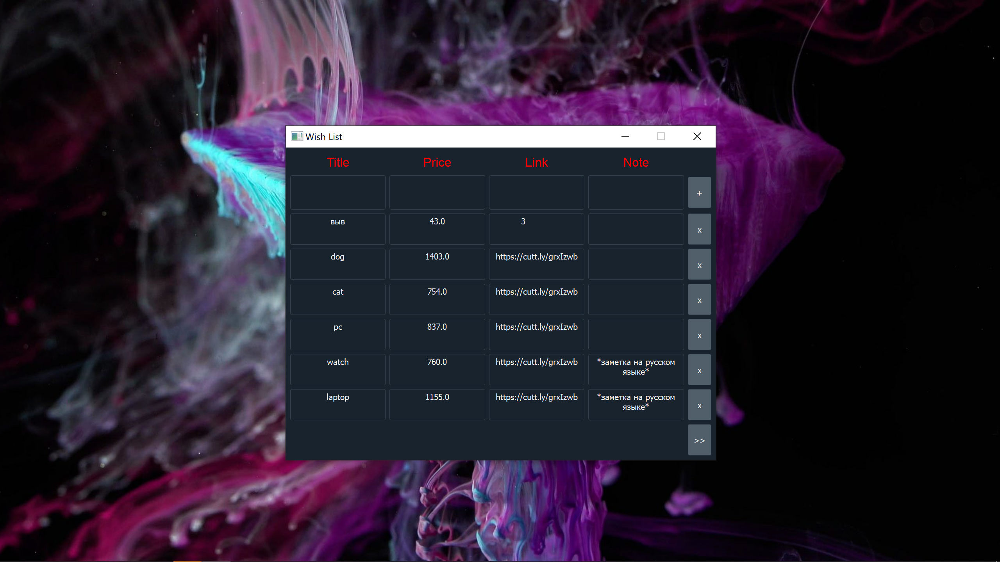

# Wish List

> Write the Wishlist application with the fields: 
> name, price, link to the purchase page, note. 
> Required Technologies: MySQL, Python + PyQT. 
    
    git clone https://github.com/SunnyCapt/tasks4work.git
    cd tasks4work/wishlist
    cd db && docker-compose up -d && cd ..
    pip install -r requirements.txt
    python app

